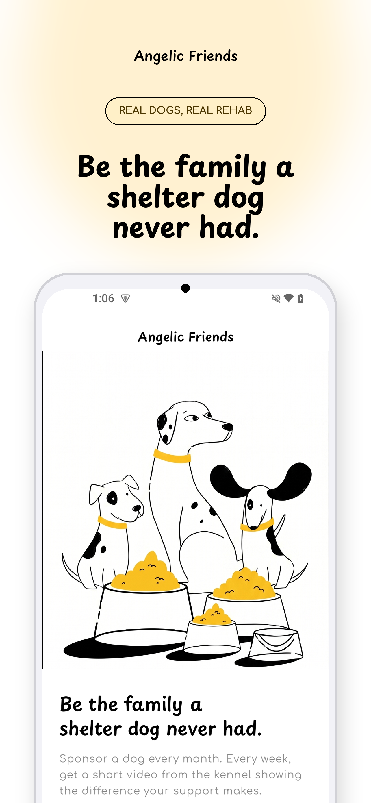
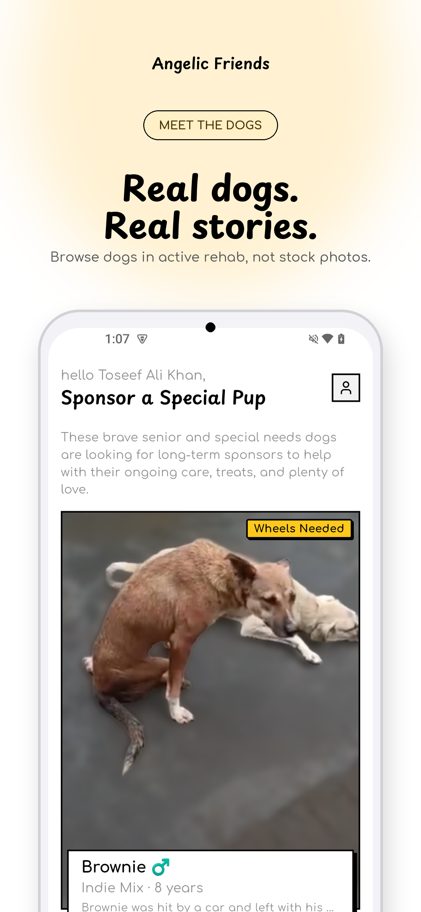
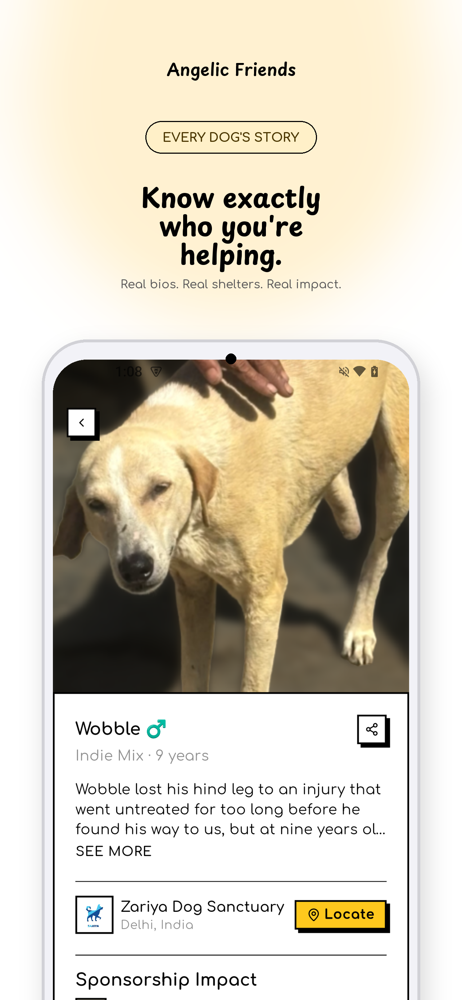
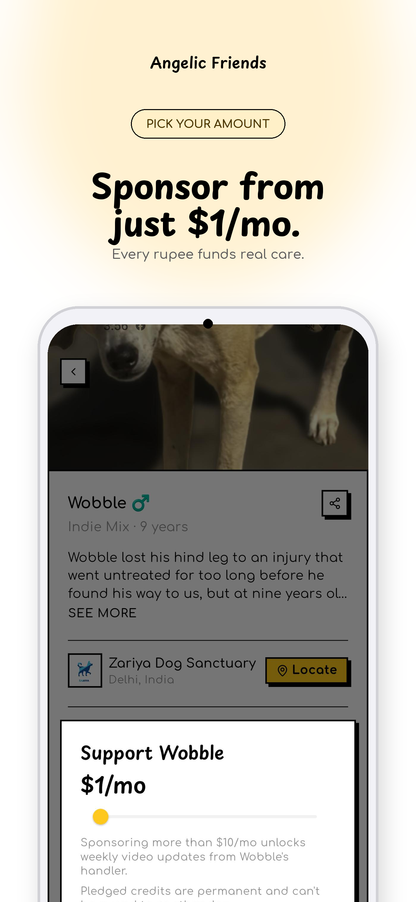
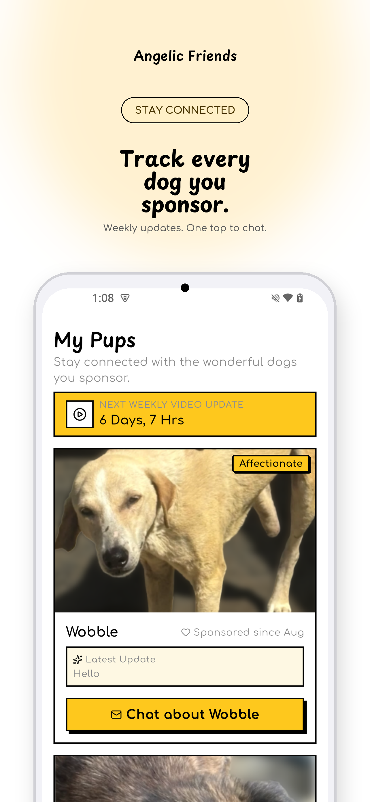
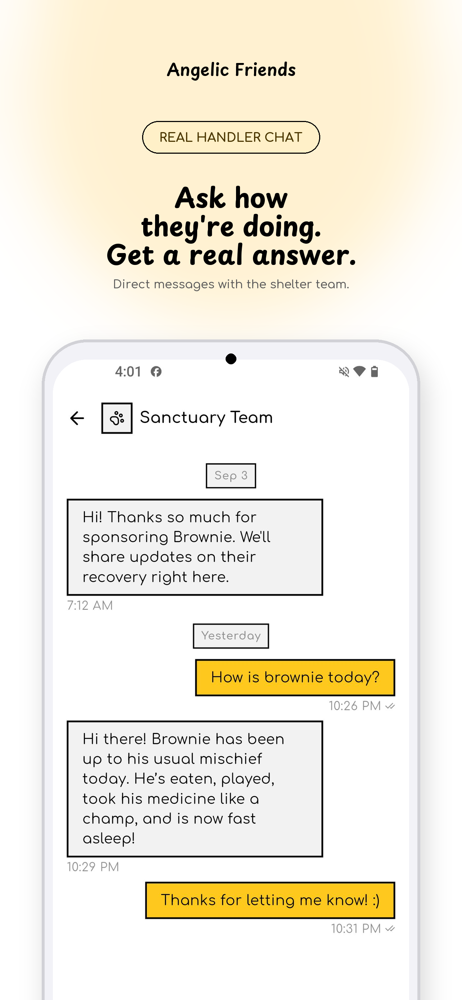
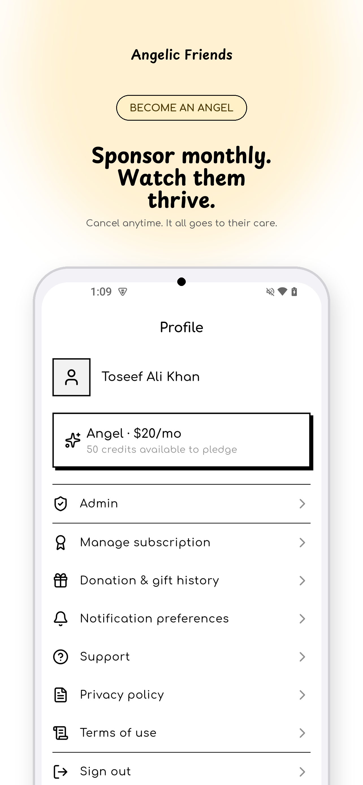

# Angelic Friends

A Flutter app that connects people with rescued and sheltered dogs through
monthly "Angel" sponsorships, one-off feeding fund pledges, and direct chat
with each dog's shelter/sanctuary team.

**[Try it now on Google Play](http://play.google.com/store/apps/details?id=com.sponsoradog.sponsor_a_dog)** · App Store: coming soon

## Screenshots

| | | |
|---|---|---|
|  |  |  |
|  |  |  |
|  | | |

## Features

- **Explore dogs** — browse rescued/sheltered dogs available for sponsorship,
  each with photos, a story, and a live funding meter.
- **Become an Angel** — subscribe monthly (three tiers) to receive Angel
  credits, then pledge those credits to any dog to sponsor them.
- **Feeding fund** — pledge credits toward the shared feeding fund for stray
  dogs, separate from individual dog sponsorships.
- **Chat with the sanctuary team** — sponsors get a direct chat thread per
  dog with the shelter/sanctuary team, including photo/video messages.
- **Weekly video updates** — sponsors pledging more than $10/mo to a dog get
  a video update from the sanctuary team most weeks (sent from an in-app
  admin tool).
- **My Pups** — a sponsor's dashboard of every dog they currently sponsor,
  their pledge history, and available/used credit balance.
- **Sign in with Google, Apple, or as a Guest** — HIG/branding-compliant
  native sign-in buttons on both platforms, with an anonymous guest mode
  that only needs a name.
- **Self-service account deletion** — Profile → Delete account immediately
  and permanently deletes a user's sponsorships, pledges, messages, and
  profile; signing in again starts a brand-new account.
- **Notification preferences, sharing, and donation history** — manage
  which notifications you get, share a dog's profile outside the app, and
  review your own pledge history.

## Tech stack

- **Flutter** (clean architecture: domain / data / presentation, `flutter_bloc`,
  `dartz` `Either<Failure, T>`)
- **Supabase** — Postgres database, auth, row-level security, storage, and
  edge functions
- **RevenueCat** — subscription and purchase management (see below)
- **Firebase** — Analytics and Crashlytics

## How we use RevenueCat

Angelic Friends sells one subscription product, "Become an Angel," in three
monthly tiers (`sponsor_angel_10/20/50_monthly`), each granting that many
Angel credits per month. Credits are a soft-currency ledger inside our own
Supabase database — RevenueCat only ever tracks the subscription itself,
never a specific dog.

- **Identity**: `Purchases.logIn`/`logOut` are called with the user's Supabase
  user ID as the RevenueCat `appUserID`, so purchases follow the account
  across devices and reinstalls.
- **Paywall**: subscribing goes through RevenueCat's hosted Paywall UI
  (`RevenueCatUI.presentPaywall()`) rather than a custom-built screen, which
  also gets us App Store/Play billing-disclosure compliance for free.
- **Managing/cancelling**: Profile → Manage subscription opens RevenueCat's
  hosted Customer Center (`RevenueCatUI.presentCustomerCenter()`), which
  handles cancellation, plan changes, and restoring purchases without any
  custom UI on our side.
- **Granting credits — webhook, not the client**: a Supabase Edge Function
  (`supabase/functions/revenuecat-webhook`) is the *only* writer of
  subscription status and credit grants. The Flutter client can never grant
  itself credits — it can only lock already-granted credits onto a dog via a
  `pledge_credits` RPC. The webhook:
  - Grants that tier's credits on `INITIAL_PURCHASE`/`UNCANCELLATION`, and
    adds each cycle's credits on top of any rollover balance on `RENEWAL`
    (unspent credits accumulate month to month).
  - Applies a `PRODUCT_CHANGE` (upgrade/downgrade) to future renewals only,
    without adjusting the current balance immediately.
  - Pauses the subscriber and their dog pledges on `EXPIRATION`/
    `BILLING_ISSUE` without losing the pledged credit amounts, which resume
    automatically on the next grant event.
  - Dedupes every event by RevenueCat's `event.id` against a
    `processed_webhook_events` table, since RevenueCat can redeliver events
    (e.g. after a timeout) and `RENEWAL` grants are additive, not naturally
    idempotent.
  - Authenticates inbound requests against a shared secret RevenueCat echoes
    back in the `Authorization` header.

## Getting started

This is a standard Flutter project — `flutter pub get` then `flutter run`.
See [docs/EULA.md](docs/EULA.md) and [docs/PRIVACY_POLICY.md](docs/PRIVACY_POLICY.md)
for the app's legal documents.
